---
header-includes:
  - \usepackage{float}
  - \usepackage{placeins}
  - \floatplacement{figure}{H}
---

# Hotel Recommendation Using Review - Derived Sentiment Profiles

## Abstract

In this we explore hotel recommendation as a multi - dimensional recommendation problem where user preferences can vary and recommender systems are needed to help users overcome information overload. Travelers rarely judge hotels solely based on rating scores.  Hotels contain aspects such as: location, cleanliness, room quality, breakfast, Wi - Fi, friendly staff, noise, value for money. Recommenders that rely solely on rating scores and limited structured hotel information fail to distinguish hotels from one another due to the missing aspect - level information and fine - grained signals. This thesis develops a hotel recommendation system pipeline on the TripAdvisor hotel dataset and explores how the recommendation performance changes as the item representation is enriched beyond static catalogue data.

The hotels are represented as:

1. Static catalogue metadata.
2. Review - derived feature frequency vectors.
3. Review - derived feature sentiment vectors.

Additionally, the recommendation pipeline goes from hotel - to - hotel recommendation to user - to - hotel recommendation through user profile construction based on the user's past reviews. Inspired by review - aware recommenders that take product reviews written by customers and transform them into experiential cases by combining case similarity with the sentiment improvement of each aspect value. The same principle is here used for recommending hotels: by performing aspect based sentiment analysis on textual reviews and extracting sentiment scores.

The enriched outputs are normalized into a fixed controlled feature set and aggregated into hotel and user profiles to support both non - personalized hotel - to - hotel and personalized user - to - hotel recommendations with the same rankers. Experimental results from the final frozen - dimension build show that the catalogue/binary baseline remains competitive on the related - hotel proxy, frequency representations improve catalogue exposure and personalized retrieval relative to the sentiment model, whilst sentiment - enhanced representations improve sentiment alignment, novelty and average recommendation rating under the available offline proxy metrics.

\newpage

# Chapter 1. Introduction

## 1.1 Context and Motivation

A user when searching for a hotel, even when filtering by attributes they value, will experience information overload as they attempt to search for a hotel that matches their preference.  User generated reviews posted online on hotels, can be used to enrich hotel item representation beyond what static catalogues can provide.

Before the popularization of reviews posted online, recommenders for hotels used catalogs and the structured data included in them. Review analysis allows recommenders to integrate the user opinion into the hotel recommendation process, making it possible to provide rich representations of hotels beyond what can be described by static catalogue attributes. The overarching idea is to capture the user experience of the item. Hotel attributes are characterized by catalog aspects and additionally by user sentiment derived from textual reviews online. Hence, hotels are modeled using the frequency of aspects mentions in reviews and the polarity toward the feature mentioned.

## 1.2 Research Problem

Standard hotel recommender systems relying on rating scores or a minimal set of structured data available about hotels aren't enough for the qualitative assessment of the experience provided. A hotel score compacts multiple dimensions into a single value, for example, Hotel A gets 4 stars and a user recommends it due to its location but complains about it being noisy, while Hotel B gets 4 stars but is praised for the breakfast served but strongly criticized because of the bad Wi - Fi. This thesis tackles the research question:

How can unstructured hotel reviews be converted to structured recommendation profiles and how does the recommendation performance change when the hotels are represented using catalogue metadata, review - derived feature frequency and review - derived feature sentiment?

## 1.3 Research Aim

The research aim of this thesis is to propose a hotel recommendation system pipeline based on the TripAdvisor hotel dataset and to study the extent to which the recommendation performance improves when hotels are represented using features beyond static catalogue data. Specifically, it compares hotel recommendations derived using static catalogue metadata, review - derived feature frequency and review - derived feature sentiment. Furthermore, the thesis extends from hotel - to - hotel to user - to - hotel recommendation by constructing user profiles based on past user reviews.

## 1.4 Objectives

to fulfil the research aim stated above, the following objectives will be achieved in this thesis:

1. Build an end - to - end system that ingests raw hotel review data from a SQL database and transforms the data into a parquet dataset.
2. Annotate hotel reviews with general aspect and aspect - level sentiment to enrich hotel reviews with a qualitative aspect score and sentiment tags.
3. Create a hotel profile that aggregates the features extracted from the hotel reviews to be used as a recommendation case representation.
4. Design and carry out three distinct item representations: catalogue - based metadata, review frequency features and sentiment - enhanced features.
5. Support both hotel - to - hotel non - personalized recommendation and user - to - hotel personalized recommendation, based on past user reviews.
6. Evaluate the performance of the different methods by offline metrics that cover not only relevance retrieval but beyond - accuracy aspects of recommendation quality.

\newpage

# Chapter 2. State of the Art: Recommender Systems and Sentiment Analysis

## 2.1 Overview of Recommender Systems

Recommender systems can be conceptualised as a system performing the function of a personalised filter that aids users in discovery of items of interest [1]. More generally speaking, a recommendation system can be described as a system for relaying recommendations accumulated from users to recipients [2]. In recent years, recommender systems have become an important part of e - commerce. They provide consumers access to relevant items and help users make decisions by narrowing down and wading through the deluge of information on the internet [3]. The existing systems can be broadly categorized into three types: collaborative filtering, content - based filtering and hybrid filtering [4]. Collaborative filtering is based on user - item interaction data and identifies neighborhood or latent patterns among users or items [5].

Content - based filtering relies on content - based characteristics of items or users to suggest content similar to that previously liked by the user, through the similarity of their feature vectors [6]. Many current recommenders integrate several filtering methods in their hybrid systems. An advantage of hybrid models is that by implementing aspects of different recommender techniques, it can synergistically overcome the weaknesses of the individual recommender [4].

## 2.2 Collaborative Filtering

Collaborative filtering was first introduced in the 1990s and it's considered the first, as well as the most ubiquitous recommendation technology. The fundamental assumption of collaborative filtering is that it is implied users who rate items similarly will continue to have similar rating patterns [7]. Tapestry was the first system which made mention of collaborative filtering in referring to a system that uses the collaborative recommendations made by users to help them sort information, by annotating and commenting on documents [2]. GroupLens subsequently added automated collaborative filtering into the same system [7]. Shardanand and Maes made the proposal of associating users together, as a method of generating word - of - mouth recommendations [8].

By the end of the 1990s, collaborative filtering systems, such as GroupLens, had started showing success. An experiment was conducted publicly on Usenet newsgroups, where the authors of GroupLens concluded that accuracy in predictions was positively correlated with providing high ratings and actively engaging with the system [9]. However, when the number of users grew too large, memory - based collaborative filtering algorithms became inefficient. Breese et al. Reviewed prediction algorithms for collaborative filtering and came up with a set of new approaches to make it more scalable by introducing model - based collaborative filtering algorithms like clustering and probabilistic models [10]. Sarwar et al. Also improved on these concepts by coming up with item - based collaborative filtering, which determines similarity among items and not users [11].

Item - based collaborative filtering performs better when the number of users exceeds the number of items [11][12]. Collaborative filtering can make recommendations on abstract items, like ideas or books, because it's domain independent [5]. However, it cannot use item content by itself, which contributes to the "cold start" problem, "first rater" problem and data sparsity in larger catalogs [13]. These limitations extend to the hotel domain where the history of users can be limited. New hotels or less popular hotels may not have an active user base to review them, making it difficult to generate useful recommendations.

## 2.3 Neighbourhood and Matrix Factorisation Methods

Early systems mainly adopted neighborhood methods, subsequently, most research work in collaborative filtering shifted focus toward latent factor and matrix factorization models, aimed at overcoming the drawbacks of data sparsity. neighborhood methods struggle to operate where the rating matrix is too sparse. Matrix factorization algorithms such as SVD exploit both user - item rating patterns to jointly learn the factors for users and items [14]. Matrix factorization can map both users and items into a latent factor space of lower dimensionality, in which preference patterns can be modelled as lower - dimensional vectors. Such algorithms are generally more powerful than neighborhood - based methods and are better at capturing the complex relationships between users and items [14]. Matrix factorization methods are one particular type of collaborative filtering method that gained prominence following the Netflix competition and became widely adopted in academia and practice as they outperformed many standard nearest neighbour algorithms. collaborative filtering utilizes either explicit or implicit feedback.

Explicit feedback  is user - generated feedback that users actively provide, such as star ratings [15]. There is a higher cost associated with acquiring this information. Monetary incentives can be used to overcome the inconvenience of  providing the information.

implicit feedback is plentiful and can be used to infer preference from user actions, such as purchases, clicks, search queries, browser history or mouse movement [15]. Not all user activity represents user preference.  Given that implicit feedback is imprecise, various models in collaborative filtering treats the signals as indicators of positive preferences with different levels of confidence [15].

## 2.4 Content - Based Filtering and Item Content Analysis

Content based filtering represents items by their attributes in conjunction with the user/query profile. It does not include information derived from other users [6].

Such content - based systems identify item attributes and can store them as keywords, descriptive attributes or plain unstructured text [16]. Given it does not require user preference data, it can be used to combat the cold - start problem  as well as cater to users with niche tastes [17]. Content - based recommender systems are grounded in the same methods as information retrieval methods. These principles are to represent items and user profiles as feature vectors, e. g. based on TF - IDF - weighted keywords and use similarity measures or machine learning algorithms to determine user interests [16][18]. The greatest challenge lies in the ability to extract enough detailed features from items. Early methods used structured meta - data or keywords from structured documents. In hotels, however, reviews remain the richest possible source from which to gather detailed descriptive features for an item. Review derived information can be mined to discover aspects and their associated score [19]. Essentially, text features extracted from reviews are rich metadata that can allow for recommendations to be made tailored to the user's needs and not just the marketing material or other catalogue content [20]. Sentiment from a review may also be considered an alternative rating for a certain feature, enhancing or replacing, the standard single - star rating [21].

## 2.5 Incorporating Textual Reviews and Sentiment Dimensions

The increase of product reviews across the internet  is a product of the global adoption of the internet. E-commerce services allow users to write comments which can be used to extract attributes that more accurately reflect user preference. The mining of aspect - based sentiment in reviews enables a recommender system to understand a user's interests and to compare items through the perspective of aspect preference dimensions [22]. Reviews  benefit both the business and user.

For users reviews provide social proof  in the absence of the physical product and business premises [23]. Additionally, users might value information from text over a star rating [24]. Businesses use review text analysis for feedback on the product or service quality [24]. When a review lacks individual aspect - level ratings, the ABSA technique can infer such scores directly from the review text [25]. The Ganu et al. study demonstrates that when they combine topic modelling and sentiment analysis in hotel review texts, rating prediction accuracy improves [26]. Multi - criteria recommender systems are also relevant because they explicitly model several dimensions of user preference [27][28]. The most relevant work to this thesis is the JIIS paper by Dong et al. [29]. They mine product reviews into a feature - based case model. Subsequently, they combine feature - based similarity with sentiment - based improvements for each feature. The proposed solution is to recommend a hotel, not only because the recommended item is similar to the query product, but also because it boasts superior aspect scores.

## 2.6 Aspect - Based Sentiment Analysis

Aspect - based sentiment analysis moves further up the hierarchy of document - level sentiment analysis by extracting sentiment from the review text [25][30]. For instance, within a single review for a hotel, one snippet might convey a positive opinion on the location, a negative review about noise and a positive mention of the room quality. This finer - grained level of detail offers benefit to recommender systems over a single polarity score for the entire document. In a typical scenario, a review - based recommender system preprocesses the review text, extracts features, detects aspect terms and classifies sentiment polarity through NLP methods [19]. Reviews produced by users are used by review - based recommender systems to score specific aspects and the associated sentiment so that more personalized and accurate recommendations can be made [31]. Sentiment analysis may be performed in various ways, ranging from lexical approaches relying on dictionaries of words rated for their sentiment to the use of machine learning classifiers, like support vector machines and logistic regression [30]. However, specific ABSA approaches first identify the aspect term and then attach the appropriate sentiment value to that term. The topic model has also been leveraged within rating prediction methods. In their HFT model, McAuley and Leskovec integrated latent factor collaborative filtering with topics discovered from review text, to identify underlying rating dimensions reflecting the topics within the reviews [32].

## 2.7 Explanations and Explainable Recommendation

An advantage of using aspect - based sentiment analysis in recommenders is that it can be leveraged to explain to the users why they've been recommended certain items [33]. Many common collaborative filtering algorithms act as "black boxes", providing users with recommendations, but failing to explain why those recommendations have been made. On the other hand, by using sentiment analysis, a system might reply: "this hotel was recommended because you value cleanliness and quietness and recent reviews praised both of those aspects. " Explainable recommendation systems create trust and satisfaction in users through transparency in the recommendation process [33]. This feature becomes important in hotel booking, where large amounts of money are invested by users on a hotel booking they rarely get to experience until check - in.

## 2.8 Large Language Models for Review Understanding

The sentiment mined by Large Language Models (LLMs) can be more nuanced and context - aware than earlier sentiment extraction techniques [34]. Through the use of prompt engineering, large language models like ChatGPT can be employed for both aspect extraction and sentiment analysis tasks without the need for specialized training [35]. This makes aspect extraction more accessible to non - specialist developers. Recent literature has explored the use of LLMs in analyzing hotel reviews, with Jeong and Lee (2024), for instance, utilizing ChatGPT to analyze hotel reviews [36]. The authors claim that ChatGPT produces a context - aware analysis for aspect - based review summaries [36]. Rule - based models remain useful, but LLM counterparts have been quickly adopted given their ease of use and performance [37]. In this project, we use a pipeline based on the OpenAI API to perform aspect - level sentiment analysis on hotel reviews, creating a solution that extracts rated dimensions without a manually annotated training set.

## 2.9 Hybrid and Advanced Recommendation Methods

When dealing with reviews, it'd be beneficial to combine the two recommenders discussed above: collaborative filtering and content - based filtering. Hybrid recommender systems are those which use multiple  approaches synergistically thus mitigating the individual shortcomings of each technique [4][38]. A hybrid approach could implement collaborative filtering as the primary recommendation system and use content from reviews as item features when recommending items to users with niche tastes. Multi - criteria recommendation is another research field that's interesting to consider because it treats preference not as a scalar rating value, but as a vector of ratings each related to a specific criterion, for instance: location, cleanliness, service quality [28]. Mining the various dimensions of hotels from their review texts could be considered a type of implicit multi - criteria system, since each dimension value is derived from text instead of explicit user input.

Deep learning has also influenced recommendation systems by learning representations from unstructured text and by using attention mechanisms to focus on informative reviews or terms [39][40][41]. In this project, however, interpretable review - derived profiles are preferred over a deep neural recommender because the aim is to compare feature representations clearly under offline metrics.

## 2.10 Evaluation Methodologies and Metrics

Typically, two types of evaluation are performed: offline experimentation and online experimentation. Offline evaluation uses historical data to estimate prediction accuracy, employing metrics like precision, recall, hit rate, mean reciprocal rank (MRR), mean absolute error (MAE) and root mean squared error (RMSE) [42]. Online evaluation takes place with a live system using A/B testing and its aim is to track user behavior via click - through or conversion rates [43]. However, accuracy alone is insufficient [44]. An accuracy - focused recommender might repeatedly recommend the same obvious or popular items. This observation gave rise to evaluation frameworks that include metrics beyond just accuracy:

1. Diversity: The variety of items recommended within a single list of results.
2. Novelty: Recommendations that are less obvious, less popular or less frequently encountered by the user.
3. Serendipity: Recommendations that are both relevant to the user and surprising relative to the user or query profile.
4. Coverage: The percentage of the item catalog that's reachable through or appears in the recommendation output.

This project employs offline evaluation. The objective is to assess not only the proxy relevance of the recommendations but also other components of recommendation quality such including coverage, context - based relevance, alignment between recommendations and user sentiment, average recommendation rating, novelty, serendipity and hit rate (HR), as well as the mean reciprocal rank (MRR).

## 2.11 Chapter Summary

Early recommender systems primarily utilized collaborative filtering methods based on numeric ratings and later broadened their scope by incorporating diverse data sources [11]. Hotels are well - suited for content - based filtering through the analysis of textual reviews [19][31]. Elements such as cleanliness, location, staff attentiveness, room quality, perceived value and available amenities are crucial factors in guests' hotel selection. Sentiment analysis of reviews about specific hotel aspects allows for personalized recommendations that align not only with a hotel's overall rating but also with what a guest genuinely values.

\newpage

# Chapter 3. Problem Definition and Objectives

## 3.1 Problem Statement

The hotel recommendation domain requires personalisation. The user should be recommended hotels that match their preferences.  A single rating score does not allow the user to conceptualise the hotel across the features that matter to them. The user wants to know that the recommendation made is curated to their preferences and the platform wants to facilitate accurate recommendations to their user base.  As mentioned in the State of The Art, textual reviews facilitate item representations that reflect user preference, and act as social proof to the consumer.

## 3.2 Research Aim

The overarching aim of this thesis is to carry out an end - to - end hotel recommender system using a TripAdvisor hotel dataset. Furthermore, the research seeks to understand how a hotel's representation, from its static metadata features and review - frequency counts to its aspects labeled with sentiment from user reviews, affects the recommendation quality achieved by the recommender system. The research extends beyond the initial objective of building a simple hotel - to - hotel recommendation system by developing a more personalized user - to - hotel recommendation system through the creation of detailed user profiles derived from historical user reviews.

## 3.3 Objectives and Item Representations

To fulfill the stated research aim, the following objectives have been defined:

1. Develop a fully reproducible, end - to - end system capable of processing raw hotel reviews from a SQL database and outputting them into a structured parquet file.
2. Enrich the hotel reviews with both overall sentiment labels and specific aspect - level sentiment annotations.
3. Consolidate the features extracted from hotel reviews into hotel profiles
4. Enable both hotel - to - hotel recommendation and user - to - hotel recommendation functionalities.
5. Evaluate recommender performance

This project utilizes three item representations. The catalogue - based item representation encompasses city, star rating, price range and amenities. Average rating is retained as a metadata summary and reported as an evaluation signal, but it is not used by the case - based ranker. Related hotels are stored for evaluation as a proxy relevance field rather than being used as a ranking input.

Table 1. Catalogue - Based Item Representation

| Signal | Source | Representation | Purpose |
| --- | --- | --- | --- |
| City | Hotel metadata | Categorical value | Filters recommendations to the same city. |
| Star rating | Hotel metadata | Numeric value | Compares the broad class of hotels. |
| Price range | Hotel metadata | Ordinal price level | Compares approximate pricing. |
| Amenities | Hotel metadata | Binary feature vector | Compares the overlap of catalogue features. |
| Average rating | Hotel metadata | Numeric summary | Reported as an evaluation signal. |
| Related hotels | Platform field | Set of hotel ids | Proxies ground truth during evaluation. |

The city attribute is employed as a categorical variable to filter recommendations to the same geographic location. Star rating and price range provide numerical and ordinal comparisons of hotel class and approximate pricing. Amenities are represented as binary features. Average rating provides a general quality overview for reporting rather than direct case - based scoring.

In the review - frequency representation, hotels are described by the normalized frequency with which their features are mentioned across all of their reviews. This score represents the proportion of a hotel's reviews that contain at least one mention of a particular aspect. For instance, a value of room_quality = 0.62 indicates that 62% of the reviews mention room quality at least once. The core signals include mined aspects like room_quality, location and staff, expressed as mention frequency values ranging from 0 to 1 and a sparse frequency vector used for cosine similarity calculations.

Table 2. Review - Frequency Item Representation

| Signal | Source | Representation | Example |
| --- | --- | --- | --- |
| Mined aspect | Review text | Controlled feature name | room_quality, location, staff |
| Mention frequency | Aggregated reviews | Value in [0, 1] | room_quality = 0.62 |
| Frequency vector | Hotel profile | Sparse feature vector | Used in cosine similarity calculations. |

The sentiment - enhanced representation includes the same features as the frequency - based model but additionally incorporates aspect sentiment, classified as positive, negative, neutral or mixed. It utilizes aspect sentiment labels such as staff = positive, aggregated aspect sentiment scores like wifi = -0.35 and a sparse feature - to - sentiment profile designed to enhance recommendations through sentiment.

Table 3. Sentiment - Enhanced Item Representation

| Signal | Source | Representation | Example |
| --- | --- | --- | --- |
| Aspect sentiment label | Review sentiment enrichment | positive, neutral, negative or mixed | staff = positive |
| Aspect sentiment score | Aggregated reviews | Average value in [-1, 1] | wifi = -0.35 |
| Feature sentiment profile | Hotel profile | Sparse feature - to - sentiment map | Used for enhancing recommendations through sentiment. |

## 3.4 Scope

The scope of this project encompasses offline recommendation, incorporating review - aware content modeling techniques, as well as the extraction of aspects and sentiment from user reviews. The objective is to achieve enriched hotel profiles that allow a system to rank recommendations  using both personalized and non - personalized recommender techniques.

\newpage

# Chapter 4. Dataset and Methodology

## 4.1 Dataset Overview

In This project we use a dataset of hotel reviews collected from TripAdvisor. This data was extracted from SQL dump files and then transformed, into an intermediate, parquet format. It includes data for 2,370 hotels, 150,961 registered members and 165,843 reviews. These hotels can be found in six cities: London, New York, Hong Kong, Singapore, dublin and Chicago. In the dataset, London has 1,016 hotels, New York has 403, Hong Kong has 367, Singapore has 275, Dublin has 164 and Chicago has 145.

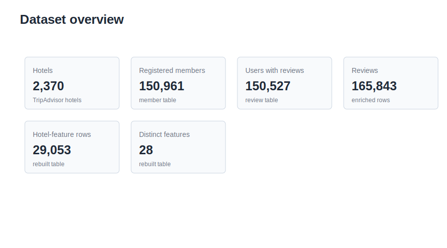

The dataset overview figure distinguishes the full registered member table from the subset of users who appear in the review table, so its users - with - reviews count is lower than the registered member count reported above.

Table 4. Hotels by City

| City | Hotels |
| --- | ---: |
| London | 1,016 |
| New York | 403 |
| Hong Kong | 367 |
| Singapore | 275 |
| Dublin | 164 |
| Chicago | 145 |

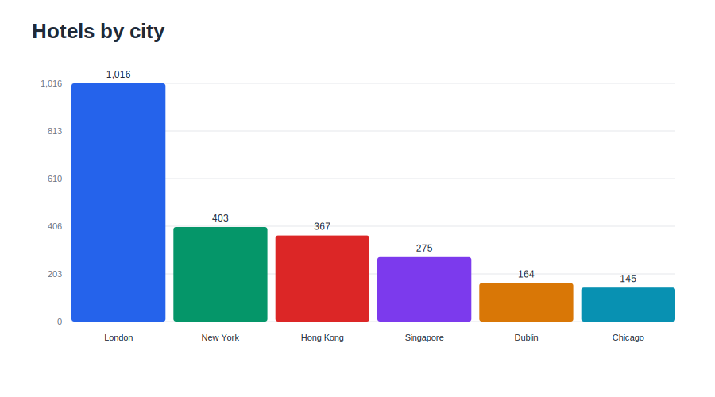

In the prepared hotel information table, the hotel metadata reviewCount field has an average of 455.98 reviews, with a median of 245 reviews. This is the scraped TripAdvisor hotel review count metadata rather than the number of local review rows attached to each hotel in the experimental dataset. This distribution shows considerable variability, with the highest number of reviews for a single hotel reaching 6,531.

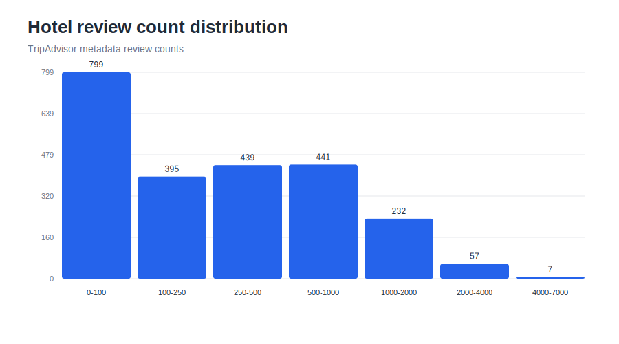

In the hotel profile table, the average hotel rating is 3.613, with a median rating of 4.0.

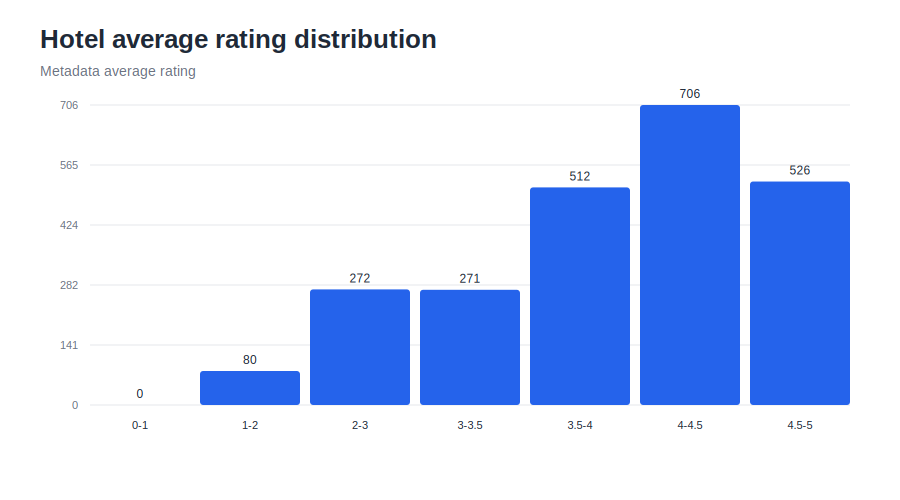

In addition to hotel features, the dataset contains, a related_hotels field, which lists related alternative hotels deemed similar enough by TripAdvisor to be displayed alongside. Each hotel in the dataset is associated with eight or nine related hotels. Examination of the raw links reveals that 20,265 non - self - related hotel links point to hotels within the local dataset, out of which 20,146 or 99.41%, refer to hotels in the same city.

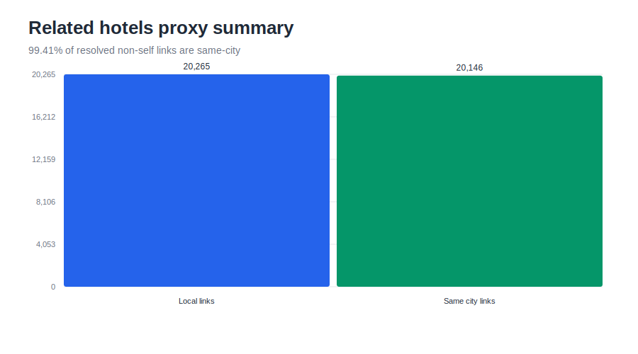

The high degree of agreement about the city makes this field a reasonable proxy for ground truth in non - personalized hotel - to - hotel recommendation. This isn't a perfect measure of relevance, as it reflects the platform's linking strategy rather than direct user preferences, but it can serve as a benchmark.

## 4.2 Data Preparation Pipeline

The system implements a data preparation pipeline, consisting of four primary stages:

1. Raw SQL tables were extracted from the original database dump files.
2. Extracted SQL tables were converted to parquet files to help faster loading and enable repeatable analyses.
3. Hotel reviews were enhanced with sentiment and aspect - level labels.
4. Hotel and user profiles were constructed, incorporating structured metadata and derived review features.

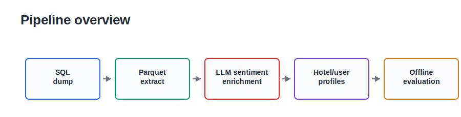

The raw data is loaded from MySQL tables named hotel, member and review. We first go through the necessary data and transform it into intermediary parquet files named `hotel.parquet`, `member.parquet` and `review.parquet`. From there, we use those files to enrich the reviews, which outputs a single file: `review_sentiment.parquet`. Finally, we use the `review_sentiment.parquet` file to generate the hotel profiles and feature profiles and we save these into the "processed data" folder as parquet files: `hotel_profiles.parquet` and `hotel_feature_profiles.parquet`. We selected parquet since the bulk of our data was for column - oriented analytical tasks which allows the developer to load only the necessary columns for a given task instead of reading the entire file when multiple processing steps require different attributes.

## 4.3 Review Sentiment Enrichment

The review sentiment enrichment stage transforms unstructured text into structured aspect - sentiment annotations. The features mined from all reviews for each hotel, along with their sentiment, can be aggregated to create a more comprehensive and representative user experience profile. Reviews are processed in batches and sent to the OpenAI API for analysis. Currently, gpt-5-nano is used as the default model. Responses include an overall sentiment label, a normalized sentiment score ranging from -1.0 to 1.0, fixed labels for the legacy aspects and a JSON array of mined aspects with their associated sentiment polarity. In the final build, mined aspects are restricted to a frozen controlled dimension set so that semantically similar phrases do not create thousands of sparse one - off feature names. The prompt provided to the model is summarized as follows:

```text
Extract sentiment signals from hotel reviews.
Return one JSON object only. Use labels positive, negative, neutral or mixed.
Use not_mentioned for a fixed aspect that is not discussed.
Use these exact top-level keys: overall_sentiment_label,
overall_sentiment_score, cleanliness, room_quality, amenities, breakfast,
wifi, noise and mined_aspects.
For mined_aspects, choose only from the frozen known dimensions:
amenities, business_center, check_in, cleanliness, food, location, noise,
room_quality, staff and value.
Classify each concrete hotel feature into the closest known dimension by
meaning. If no known dimension fits, omit that aspect from mined_aspects.
Do not return new dimensions or neutral placeholder rows.
```

The model's output is normalized into a consistent parquet schema, with each processed row containing the following enrichment fields:

```text
overall_sentiment_label
overall_sentiment_score
cleanliness
room_quality
amenities
breakfast
wifi
noise
mined_aspects_json
```

The final version does not attempt to mine aspect dimensions. It forces it to choose directly among a precompiled list of features. The open ended mining used before resulted in feature explosion where semantically similar concepts were duplicated across different labels. The evaluation data uses 10 fixed dimensions. The fixed set of dimensions is presented next: amenities, business_center, check_in, cleanliness, food, location, noise, room_quality, staff and value. So, if a review refers to "rooms" or "bedrooms" or "bathrooms" for instance, it should be identified as room_quality.

The feature set was chosen to cover the recurring hotel attributes identified in the literature rather than to discover a new vocabulary for every run. Rhee and Yang examine hotel attributes including value, location, sleep quality, rooms, cleanliness and service, while Xiang et al. show that large scale hotel review text analysis reveals repeatable guest experience dimensions associated with satisfaction [45][46]. The selected dimensions keep these common review concerns while adding dataset relevant operational categories such as food, check_in, amenities and business_center.

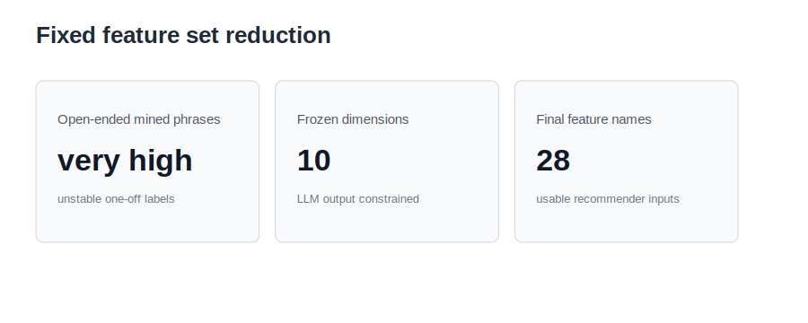

The enriched review file used for the final evaluation reveals the following distribution of overall sentiment: 82,573 positive reviews, 22,837 negative reviews, 16,198 mixed reviews and 44,235 neutral reviews. Because the final run was stopped at a time - constrained checkpoint, 122,259 of 165,843 reviews (73.7%) contain frozen - dimension mined_aspects_json. The remaining rows retain complete fixed sentiment labels and still contribute to the fixed aspect and catalogue/recommend_list signals.

Table 5. Review Sentiment Distribution

| Sentiment label | Reviews |
| --- | ---: |
| Positive | 82,573 |
| Negative | 22,837 |
| Mixed | 16,198 |
| Neutral | 44,235 |

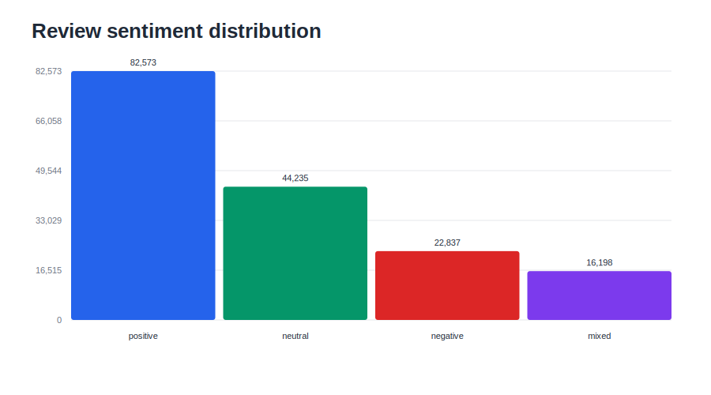

The most frequently occurring frozen mined dimensions identified were amenities, room_quality, staff, location and cleanliness. The final JSON enrichment is intentionally restricted to ten mined dimensions. At the review level, the most common mined aspects were amenities with 105,140 mentions, room_quality with 100,789, staff with 99,294, location with 96,758, cleanliness with 73,016, value with 65,833, check_in with 51,243, noise with 41,924, food with 33,515 and business_center with 208.

Table 6. Top Mined Review Aspects

| Aspect | Review - level mentions |
| --- | ---: |
| amenities | 105,140 |
| room_quality | 100,789 |
| staff | 99,294 |
| location | 96,758 |
| cleanliness | 73,016 |
| value | 65,833 |
| check_in | 51,243 |
| noise | 41,924 |
| food | 33,515 |
| business_center | 208 |

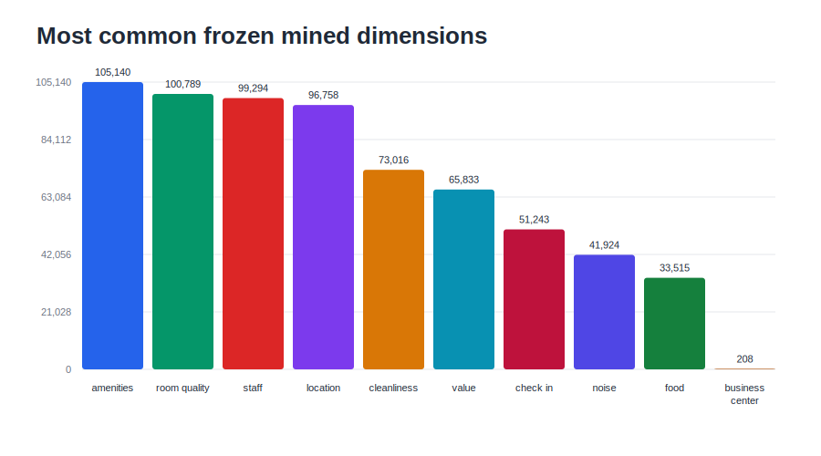

## 4.4 Constructing Hotel Profiles

The central Hotel object is an instance of case representation that can store multiple representations of a single hotel. It contains meta-data feautures such as features like city, rating, price, amnesties, general ratings, relevant hotels, boolean representations of cataloged and mined features for the hotel, a frequency vector to describe what proportion of its reviews mention certain features, average sentiment score vector per each hotel feature and feature sentiment profile to present a way for a hotel's sentiment to be represented and contrasted with other similar hotels on features that often recur in the collection of hotel reviews.

In the current processed build, the hotel feature profile table contains 29,053 hotel - feature rows and 28 distinct feature names. This compact feature space is a direct result of freezing the mined aspect registry to the ten controlled dimensions while retaining catalogue amenities and cleaned recommendation-list features.

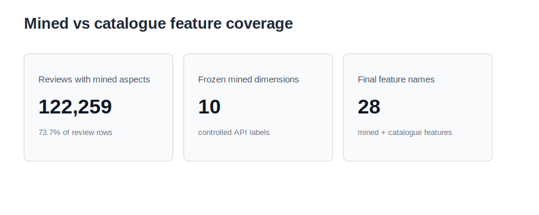

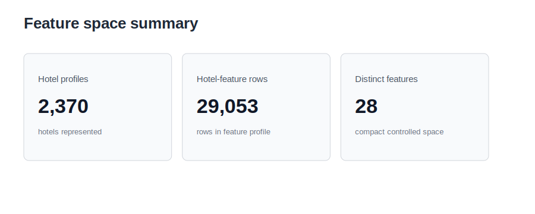

The main conceptual difference between these views of each hotel lies in the separation of the catalogue feature view, feature frequency view and feature sentiment view. This allows the selected ranker to use the representation it needs without forcing all signals into a single vector.

The aspect sentiment profile is a small, fixed subset of dimensions that summarizes a hotel by combining its overall sentiment with several legacy aspects such as cleanliness, room_quality, amenities, breakfast, wifi and noise. The feature mention frequency summarizes a hotel in terms of how often fixed mined dimensions and catalogue features appear in its reviews. The feature sentiment profile summarizes a hotel as a sparse map of averaged sentiment values for each controlled feature that's part of its set. In this context, positive sentiments are treated as label 1, negative sentiments as label -1 and neutral or mixed sentiments as label 0. API numeric sentiment scores in the [-1, 1] range are also retained, so the implementation can be interpreted as a soft generalization of the count - based sentiment equation.

These profiles are used in three different forms, as shown in Section 4.5, corresponding to the configurations proposed by Dong et al. [29]: case - based, frequency - based and sentiment - enhanced, with products replaced by hotels and product features by hotel aspects.

\FloatBarrier

## 4.5 Recommendation Models

The following section presents the models developed for this project. The case - based reasoning model functions as a catalog - style baseline, while the frequency - based and sentiment - enhanced models use the same vector - space similarity calculation technique, differing only in their choice of $v_i$. In the subsequent discussion, $X$ represents the query hotel or user profile, $Y$ represents a candidate hotel, $F_i$ represents a hotel feature and $Reviews(H)$ denotes the set of reviews for hotel $H$. Each hotel is represented as a feature vector as follows:

\begin{equation} V(H) = (v_1(H), v_2(H), \ldots, v_n(H)) \label{eq:hotel-vector} \end{equation}

Missing feature values are set to zero and the same vector - space cosine similarity metric is used to compare two hotel vectors.

\begin{equation} Sim(X, Y) = \frac{ \sum_{i=1}^{n} v_i(X)v_i(Y) }{ \sqrt{\sum_{i=1}^{n} v_i(X)^2} \sqrt{\sum_{i=1}^{n} v_i(Y)^2} } \label{eq:vector-similarity} \end{equation}

Given that the vector - space calculation is shared between the two review - based models, the difference lies in the definition of $v_i$: one model employs mention frequency and the other uses sentiment. The case - based baseline is kept separate as it utilizes direct metadata and binary feature agreement instead of cosine similarity over review vectors.

### 4.5.1 Case - Based Metadata Ranker

The first model compares hotels based on star rating, price level and binary feature agreement. Star rating and price level were quantified using bounded numerical similarity. The binary layer includes catalogue amenities and the presence of mined features, thus, this baseline can best be understood as a simple case - based catalogue/binary baseline than a pure metadata - only baseline. Binary features are assigned a value of 1 when both hotels agree on the presence or absence of a feature and 0 when they differ. Finally, the ranking is determined by the average of the applicable scores from these components, calculated as follows for a query hotel $X$ and a candidate hotel $Y$:

\begin{equation}
\begin{aligned}
Score_M(X,Y) = \operatorname{Average}\big(&
    \operatorname{StarSimilarity}(X,Y),\\
&   \operatorname{PriceSimilarity}(X,Y),\\
&   \operatorname{BinaryFeatureAgreement}(X,Y)
\big)
\end{aligned}
\label{eq:metadata-score}
\end{equation}

This approach facilitates easy, understandable evaluation, demonstrating whether richer review - vector representations improve ranking compared to a simple catalogue/binary case representation.

### 4.5.2 Frequency - Based Ranker

The second ranker model employs vector - space similarity using feature frequencies extracted from reviews. The rationale behind this technique being that two hotels are considered similar if their review - derived vectors have a similar orientation in the feature space, accounting for review semantics but disregarding the positive or negative sentiment. Specifically, the value for a feature $F_i$ for hotel $H$ is calculated as the frequency with which it appears in the reviews of $H$:

\begin{equation} v_i(H) = Pop(F_i, H) = \frac{ \left|\{R_k \in Reviews(H): F_i \in R_k\}\right| }{ \left|Reviews(H)\right| } \label{eq:popularity} \end{equation}

This value is then input into the cosine similarity function presented above. For instance, if 62% of reviews for hotel A mentioned room_quality, then the room_quality in the frequency vector of hotel A is 0.62.

### 4.5.3 Sentiment - Enhanced Ranker

The third model further enhances the utility of review data for recommendation ranking by integrating sentiment similarity with a sentiment improvement term. It extends beyond mention frequency, evaluating the candidate hotel in relation to the query hotel on features shared with the query hotel. Drawing inspiration from the work of Dong et al. [29], the sentiment $Sent(F_i, H)$ for a hotel $H$ for a feature $F_i$ is given by:

\begin{equation} Sent(F_i, H) = \frac{ Pos(F_i, H) - Neg(F_i, H) }{ Pos(F_i, H) + Neg(F_i, H) + Neu(F_i, H) } \label{eq:sentiment} \end{equation}

where $Pos(F_i, H)$, $Neg(F_i, H)$ and $Neu(F_i, H)$ represent the counts of positive, negative and neutral or mixed sentiments, respectively, for feature $F_i$ across all reviews for hotel $H$. For this ranker model, the value for the feature $F_i$ is $Sent(F_i, H)$:

\begin{equation} v_i(H) = Sent(F_i, H) \label{eq:sentiment-vector-value} \end{equation}

The vector cosine similarity between the $V(H)$ vectors is calculated and then scaled from [-1, 1] to [0, 1] using:

\begin{equation} Sim_S(X, Y) = \frac{Sim(X, Y)+1}{2} \label{eq:sentiment-similarity} \end{equation}

The model calculates an improvement measure. This quantifies how well a candidate hotel performs compared to a query hotel on shared aspects. The logic being that recommendation candidates should not only be similar, but should also show improved scores where the same aspects are present.

\begin{equation} Imp_i(X, Y) = \frac{1}{2} \left( 1 + \frac{Sent(F_i, Y)-Sent(F_i, X)}{2} \right) \label{eq:feature-improvement} \end{equation}

This value is averaged over the set of shared features, $F(X) \cap F(Y)$, between $X$ and $Y$:

\begin{equation} Imp(X, Y) = \frac{ \sum_{F_i \in F(X) \cap F(Y)} Imp_i(X, Y) }{ \left|F(X) \cap F(Y)\right| } \label{eq:sentiment-improvement} \end{equation}

$F(H)$ means set of mined features from reviews for hotel $H$. Values $\ge$ 0.5 indicate better performance by candidate hotel relative to query. Values $<$ 0.5 indicate worse performance. $Sim_S$ and $Imp$ are weighted by $\alpha \in [0, 1]$. Default $\alpha = 0.5$:

\begin{equation} Score_S(X, Y) = (1-\alpha)Sim_S(X, Y) + \alpha Imp(X, Y) \label{eq:score} \end{equation}

If there is no shared sentiment evidence between the query and candidate profiles, the implementation assigns the improvement component a neutral value of 0.5.

If reviews for hotel $X$ include room_quality and hotel $Y$ reviews feature the same aspect, then $Sent(room_quality, X)$ and $Sent(room_quality, Y)$ are compared and a candidate boost is given if its performance exceeds the query hotel's performance on this aspect. This is also true for features such as cleanliness, staff, location, wifi and breakfast if they're also present in both profiles.

## 4.6 User Profile Construction

User profiles are constructed to provide personalization, based on users' review histories, using a leave - one - review - out evaluation protocol. For each eligible user, each positive review (rating $\ge$ 4) is held out, one by one. The held - out review is used as a target recommendation and the rest of the user's reviews are used to build the profile. If a user has more than one eligible positive review, then the user can contribute more than one held - out target. Similar to hotel profiles, user profiles consist of binary, frequency, sentiment and feature sentiment feature vectors, generated from reviews' content. Both hotels and users have features extracted, so the same set of recommendation models can be employed to recommend hotels based on either a query hotel or a query user. In fact, a user's frequency feature vector can act as a feature weighting signal, which implies features mentioned by a user more often would weigh more compared to features mentioned only rarely by them.

The detailed procedure to prepare user profiles and personalized recommendations is as follows:

1. Select users who have published at least five reviews.
2. For each of these users, hold out every review with a rating greater than or equal to 4.0 as an eligible target recommendation.
3. Omit the current held - out review from the user's previously written reviews.
4. Construct the user profile using the same method to aggregate hotel profiles, but with the tailor - made set of remaining reviews.
5. Set the city of the held - out hotel as the query city, thereby constraining search space by city.
6. Remove from the recommendation list hotels which are present in the user's remaining review history.
7. Rank candidate hotels and determine if the held - out hotel is in the top k recommendations.

## 4.7 Methodological Rationale

The rankers employed in the scope of this research are content - based, but the system employs a hybrid approach by considering well - established hotel attributes as a baseline reference and augmenting these with an extracted review - based component, representing the hotel's quality. Hotel static attributes consist of star rating, price range, catalogue amenities, city, review count, average rating and related hotels. These are valuable as simple, ready to use metadata for general purpose comparisons, yet often don't represent the real customer experience. User - generated content from reviews sheds light on such experiential attributes like service attitude, room quality, property quality, cleanliness, easy access to travel attractions nearby, level of noise, price affordability, breakfast quality and Wifi connectivity. Extracted review features profile hotels in the perspective of guests' feedback after staying at a hotel, not its advertised features. To transform those long open texts into appropriate inputs for recommendation engines, we use the use of LLMs for extracting, among other things, overall sentiment and sentiment for the fixed hotel feature set. The controlled dimensions mean the model classifies review evidence into known categories rather than creating new labels after extraction. This allows us to match both traditional metadata and text from reviews while keeping the feature space fixed to the controlled dimensions, offering an interpretable yet informative profile to student research, also benefiting from semantic context conveyed by reviews.

\newpage

# Chapter 5. System Design and Implementation

## 5.1 Architecture

The recommender system is made of a set of Python scripts within src/rec/, containing pipeline stages: data reading, review processing, recommender profile creation, recommender training and recommendation evaluation. Python entry - point scripts are located in the scripts/ folder and orchestrate each execution part. The system workflow can be described as:

1. Read parquet files hotel.parquet, member.parquet and review.parquet.
2. Enrich reviews with overall and aspect - level sentiment.
3. Mine hotel - relevant aspects and their sentiments.
4. Aggregate signals into hotel and user profiles.
5. Initialize recommender with a similarity - based ranker.
6. Fit recommender with ranker and profile collection.
7. Generate recommendations by comparing candidate hotels with a hotel profile target or a user profile query.
8. Evaluate recommender using relevance, coverage, city match, sentiment alignment, novelty, serendipity, hit rate and mean reciprocal rank.

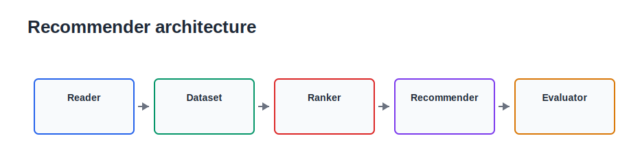

## 5.2 Data Layer

The Reader class in the data layer reads, filters and structures data from input parquet hotel, member and review files into Python objects. Each part of the pipeline is aware of the necessary attributes and thus reads them in memory so as not to consume excessive amounts of RAM. While loading the data, the Reader identifies hotels based on given parameters and conducts basic data cleaning. Hotel objects include both metadata and information from their reviews. Metadata includes name, city, star rating, price range, average rating, review count, amenities and related hotels. These metadata features are stored together in Hotel objects along with review - derived vectors. Instead of defining separate Hotel types, a unified approach is adopted where each primary Hotel object contains multiple representations of the hotel: a metadata representation, a binary feature vector to be used for case - based comparisons, a frequency feature vector reflecting aspect occurrences in hotel reviews, a sentiment feature vector to reflect the sentiment of mined aspects and a feature sentiment profile to check which hotel appears to perform better than the other on given aspects.

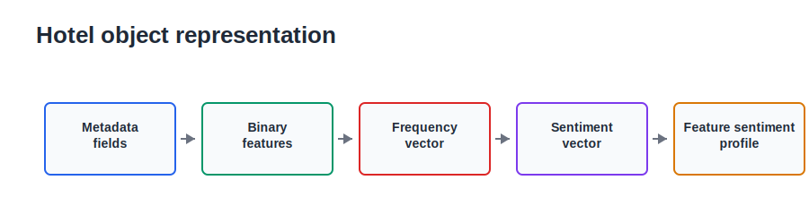

The important part of the object definition is shown below.

```python
class Hotel:
    def __init__(
        self,
        id,
        name,
        city,
        star,
        priceRange,
        averageRating,
        reviewCount,
        amenities,
        relatedHotels,
        sentimentProfile,
        binaryFeatureVector=None,
        frequencyFeatureVector=None,
        sentimentFeatureVector=None,
        featureSentimentProfile=None,
        priceLevel=None,
        sourceType="hotel",
    ):
        self.id = id
        self.name = name
        self.city = city
        self.star = star
        self.priceRange = priceRange
        self.averageRating = averageRating
        self.reviewCount = reviewCount
        self.amenities = amenities
        self.relatedHotels = relatedHotels
        self.sentimentProfile = (
            sentimentProfile
            if sentimentProfile is not None
            else {}
        )
        self.binaryFeatureVector = (
            binaryFeatureVector
            if binaryFeatureVector is not None
            else {}
        )
        self.frequencyFeatureVector = (
            frequencyFeatureVector
            if frequencyFeatureVector is not None
            else {}
        )
        self.sentimentFeatureVector = (
            sentimentFeatureVector
            if sentimentFeatureVector is not None
            else {}
        )
        self.featureSentimentProfile = (
            featureSentimentProfile
            if featureSentimentProfile is not None
            else {}
        )
        self.priceLevel = priceLevel
        self.sourceType = sourceType
```

Next, hotel reviews and member information are loaded into pandas dataframes and hotel reviews are grouped together to derive hotel - level profiles. Similarly, for personalized recommendations, user profiles are created by treating member reviews from previous stays as one review collection. Enriched sentiment is attached if `review_sentiment.parquet` is available. If such file is found, Reader class is attempting to use it, otherwise, it falls back to raw review parquet file. When a newer hotel profile parquet cache is present, the Reader loads those prebuilt vectors directly to avoid reparsing every enriched review during evaluation. Nevertheless, the system can continue, but with a potential increase in recommendation quality if enriched sentiment alongside mined aspects are present.

## 5.3 Sentiment Processing Implementation

Sentiment enrichment is performed as a batch processing pipeline. Reviews are processed in small mini - batches, to ensure manageable computational costs. Results from each batch are occasionally saved to parquet and a portion of review rows is marked for future reprocessing. Since processing all approximately 165k reviews at once isn't feasible, the script checks required output fields and resumes from rows where required enrichment is missing. This includes cases where the overall_sentiment labels, scores, fixed aspect fields or mined_aspects_json are missing. API failures are recorded in analysis_error and checkpoint saves allow the run to continue later. This practice helps maintain a clean list of valid reviews when building profiles, ensuring that downstream models are using reliable data without invalid aspect arrays or sentiment scores.

## 5.4 Recommender Layer

The HotelRecommender class's main functionality relies on delegating the score calculations to an instance of a Ranker object given to its constructor. This approach implements a strategy pattern. All Rankers conform to a common interface:

```python
class Ranker:
    isSymmetric = True
    name = "Ranker"

    def prepare(self, dataset):
        self.dataset = dataset

    def getRankScore(self, X, Y):
        raise NotImplementedError(
            "Subclasses must implement getRankScore"
        )

    def getSimilarity(self, X, Y):
        score = self.getRankScore(X, Y)
        if score < 0:
            return 0.0
        if score > 1:
            return 1.0
        return score
```

Rankers are subclasses that extend this base class. The case - based ranker operates on standard catalogue data and binary metadata. The frequency - based ranker calculates cosine similarity over the hotel's feature mention frequencies. The sentiment - enhanced ranker uses sentiment vectors and additionally checks if the candidate hotel is better than the query hotel on features shared by both. The frequency - based ranker overrides getRankScore() by calculating cosine similarity between two sparse frequency feature vectors. In the case of personalized recommendations, the user's frequency vector acts as feature weights in the ranking function:

```python
def getRankScore(self, X, Y):
    if self.usesUserFeatureWeights(X):
        return getWeightedCosineSimilarity(
            X.frequencyFeatureVector,
            Y.frequencyFeatureVector,
            X.frequencyFeatureVector,
        )
    return getCosineSimilarity(
        X.frequencyFeatureVector,
        Y.frequencyFeatureVector,
    )
```

The sentiment - enhanced ranker implements the same structure but overrides the similarity calculation method, so that getSimilarity() uses sentiment vectors for direct comparison. Its getRankScore() then combines this normalized sentiment - vector similarity score and the sentiment improvement score:

```python
def getSimilarity(self, X, Y):
    if self.usesUserFeatureWeights(X):
        return getWeightedNormalizedCosineSimilarity(
            X.sentimentFeatureVector,
            Y.sentimentFeatureVector,
            X.frequencyFeatureVector,
        )
    return getNormalizedCosineSimilarity(
        X.sentimentFeatureVector,
        Y.sentimentFeatureVector,
    )

def getRankScore(self, X, Y):
    similarity = self.getSimilarity(X, Y)
    improvement = self.getSentimentImprovement(X, Y)
    return (
        (1.0 - self.sentimentWeight) * similarity
        + self.sentimentWeight * improvement
    )
```

The flexibility of the recommender allowing for any Ranker instance via its constructor allows testing different recommendation models by simply changing one parameter:

```python
def getRankers(profileMode, sentimentWeight):
    if profileMode == "case":
        return [("Case - based Metadata", CaseBasedRanker())]
    if profileMode == "frequency":
        return [("Frequency - based", FrequencyBasedRanker())]
    if profileMode == "sentiment":
        return [
            (
                "Sentiment - enhanced",
                SentimentEnhancedRanker(sentimentWeight),
            )
        ]
```

The Recommender class is responsible for the candidate selection logic, excluding invalid hotels, applying the city constraint, calling rankers, sorting the results and optionally performing a diversity re - ranking. Rankers themselves focus on nothing more than assigning a similarity score to an individual candidate hotel given a query profile. This division is observable in the core recommendation loop below:

```python
for hotelId in self.getCandidateHotelIds(profile, excludeIds):
    hotel = self.dataset.getHotel(hotelId)
    score = self.ranker.getRankScore(profile, hotel)
    candidates.append((hotelId, score))

candidates.sort(key=lambda row: (-row[1], row[0]))
return self.getRankedCandidateIds(profile, candidates)
```

The Ranker object also provides a similarity method used by Diversity rankers. This is important, as diversity re - ranking requires access to the similarity score between recommended hotels, not just how well each one fits the query.

## 5.5 Evaluation Layer

Two types of offline evaluation methods exist: non - personalized item - to - item evaluation and personalized user - to - item evaluation. Non - personalized recommendation works by choosing a single hotel as a query and having the recommender produce a ranked list of candidate hotels similar to the query hotel. In the personalized recommendation setting, we first construct a user profile based on her previous reviews, before the one positively rated review we hold out. The purpose of the personalized evaluator is to promote the held - out hotel to the highest possible position in the recommended hotels list. Having both ways is beneficial to evaluate the relevance and quality of feature representations from both perspectives of item - to - item and user - to - item recommendations.

\newpage

# Chapter 6. Experimental Design

## 6.1 Non - Personalized Evaluation

We evaluate recommendation performance for hotels in the non - personalized setting. Each hotel in the set of query hotels will be used as a query hotel and the recommender will produce a sorted list of similar hotels. To emulate the usual hotel search behaviour, we impose a "same city" restriction: for a query hotel in a given city, only other hotels in that same city are considered as candidates. Because most resolved related_hotel links are also same - city links, this city filter makes candidate sets align partly with a proxy. As such, city match is used as a sanity check rather than independent validation of model performance. The closest proxy for relevance to use offline is the related_hotels field: a recommended hotel is relevant if it can be found in the related_hotels list of the query hotel. It's a proxy, since this is an approximation, rather than a decision by a real user choosing their preferred related hotels. The value is based on TripAdvisor's decision, instead. For this experiment, each model is evaluated with $k = 10$, which means that each target hotel received a list of 10 recommendations.

## 6.2 Personalized Evaluation

For the personalized evaluation, each eligible positive review is held out from each eligible user in the evaluation set and the remaining reviews are used to construct the user's profile. Eligible users are those who have posted at least five reviews in the evaluation set. Reviews with ratings greater than or equal to 4 are eligible target recommendations. As one user may have multiple eligible positive reviews, the number of held - out targets can be higher than the number of eligible users. The recommender is tasked with recommending hotels in the same city as the held - out hotel. Excluded are also hotels that the user has already visited in the rest of the reviews for profile generation. This situation examines whether the recommender can identify a previously liked hotel based on all other reviews provided by the user.

## 6.3 Metrics

The metrics for non - personalized recommendation are:

1. Relevance@k / Rel@k: Proportion of top - k recommendations that fall in the set of related hotels to the target hotel. This is reported as Rel. @10 in the results.
2. Target coverage: Fraction of target hotels that the recommender provides results for.
3. Catalogue coverage: Fraction of the hotel catalogue that's mentioned at least once in the generated top - k recommendations lists. Abbreviated previously as recommendation coverage.
4. City match: Proportion of recommendations in the same city as the target hotel. Since it's imposed by design in the candidate generator, this should be taken as a sanity check rather than a model performance measure.
5. Sentiment alignment: Normalized cosine similarity between the sentiment vectors of the target and candidate hotels, scaled into the [0, 1] range.
6. Recommended rating: Average rating of the recommendations.
7. Novelty: Log - scaled inverse popularity, in which hotels that are reviewed less frequently have higher novelty.
8. Serendipity: Relevance multiplied by content surprise and novelty.

The metrics for personalized recommendation are:

1. HitRate@10: The proportion of the held - out positive reviews within the top 10 recommendations.
2. MRR: The Mean Reciprocal Rank for the held - out review.
3. Novelty: Average novelty of the held - out target hotels in the evaluated target set.
4. Serendipity: Content surprise between the user profile and held - out target, multiplied by the held - out target novelty.

\newpage

# Chapter 7. Results and Discussion

## 7.1 Non - Personalized Results

The non - personalized results at $k = 10$ indicate that target coverage and city match are 1.0000 across all three models. Target coverage means that each hotel used as query receives recommendations. City match is a direct consequence of the candidate generator's policy to only select same - city hotels as candidates, so it's a sanity check.

The baseline case - based ranker yields Relevance@10 = 0.1192, catalogue coverage = 0.4810, sentiment alignment = 0.7795, average rating = 4.0163, novelty = 0.2556 and serendipity = 0.0039. The frequency - based ranker obtains Relevance@10 = 0.1076, catalogue coverage = 0.5059, sentiment alignment = 0.7780, average rating = 3.9775, novelty = 0.2712 and serendipity = 0.0042. The sentiment - enhanced ranker achieves Relevance@10 = 0.0804, catalogue coverage = 0.2401, sentiment alignment = 0.8281, average rating = 4.2959, novelty = 0.3490 and serendipity = 0.0017.

**Table 7. Non - Personalized Hotel - to - Hotel Results**

| Model | Rel.@10 | Cat. cov. | Sent. align. | Avg. rating | Novelty | Serendipity |
| --- | ---: | ---: | ---: | ---: | ---: | ---: |
| Case - based | 0.1192 | 0.4810 | 0.7795 | 4.0163 | 0.2556 | 0.0039 |
| Frequency - based | 0.1076 | 0.5059 | 0.7780 | 3.9775 | 0.2712 | 0.0042 |
| Sentiment - enhanced | 0.0804 | 0.2401 | 0.8281 | 4.2959 | 0.3490 | 0.0017 |

The figure below visualizes Relevance@10, catalogue coverage and sentiment alignment because these metrics share a comparable 0 to 1 scale. Average rating, novelty and serendipity are retained in the table to avoid mixing incompatible scales in one chart.

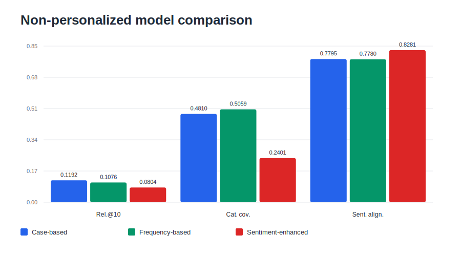

In the frozen - dimension build, the case - based baseline yields the highest related - hotel proxy relevance, while the frequency model yields the highest catalogue coverage and serendipity. Frequency achieves Relevance@10 = 0.1076 compared to 0.1192 for case - based baseline and 0.0804 for sentiment - enhanced. This suggests that compressing mined review aspects into a small controlled dimension set improves stability and catalogue exposure, but it also reduces some of the fine - grained variation that previously helped the frequency model dominate the related - hotel proxy.

Sentiment shows the best results on sentiment alignment, average recommendation rating and novelty. This suggests that, in the proxy measures available to us, it tends towards quality - oriented ranking rather than purely similarity - oriented retrieval. Caution should be advised here. As sentiment is generated from sentiment vectors, stronger alignment means the ranker behaves as it should. Its increased average rating also fits with its improvement component rewarding candidate hotels that perform better on shared aspects.

Sentiment also shows higher novelty than frequency paired with a lower catalogue coverage. This means that it tends to recommend less reviewed hotels on average, but from a narrower range of hotels. Frequency still wins serendipity calculation due to the interaction of relevance and surprise and frequency already has stronger related - hotel relevance than sentiment. Case - based metadata remains competitive in this frozen - dimension setting, indicating that simple metadata cues and binary features carry substantial importance.

## 7.2 Interpretation of Non - Personalized Findings

The non - personalized study brings to light a clear tradeoff. In the final frozen - dimension build, case - based metadata is strongest on the related_hotels proxy, frequency - based ranking exposes the widest catalogue, and sentiment - enhanced ranking is strongest on sentiment alignment, average recommendation rating and novelty. The related_hotels field remains an approximation rather than ground truth. It likely reflects TripAdvisor's own related - hotel logic, such as hotels often viewed together or curated alternatives, rather than the genuine intention of a user trying to find related hotels. A model that does not win on every proxy metric should therefore not be rejected outright, because it may perform better on another task: suggesting hotels that offer better experiences than the query hotel. This is an essential component of this project. As stated at the beginning of the project, sentiment extracted from hotel reviews should not be merely one of many features; it should be used as a ranking signal to alter how the recommendation model optimizes.

## 7.3 Personalized Results

In the experiment with Personalized Leave - One - Review - Out, the frequency - based model was applied to 446 positive leave - out review instances. On average, the frequency - based model returned a HitRate@10 of 0.0381, MRR of 0.0112, novelty of 0.3225 and serendipity of 0.0975. The sentiment - enhanced model obtained a HitRate@10 of 0.0224, MRR of 0.0034, novelty of 0.3225 and serendipity of 0.0975 on the same dataset of 446 positive instances.

**Table 8. Personalized User - to - Hotel Results**

| Mode | Targets | HitRate@10 | MRR | Novelty | Serendipity |
| --- | ---: | ---: | ---: | ---: | ---: |
| Frequency | 446 | 0.0381 | 0.0112 | 0.3225 | 0.0975 |
| Sentiment | 446 | 0.0224 | 0.0034 | 0.3225 | 0.0975 |

The figure below focuses on HitRate@10 and MRR because these are the primary personalized ranking metrics and share a comparable scale. Novelty and serendipity are reported in the table.

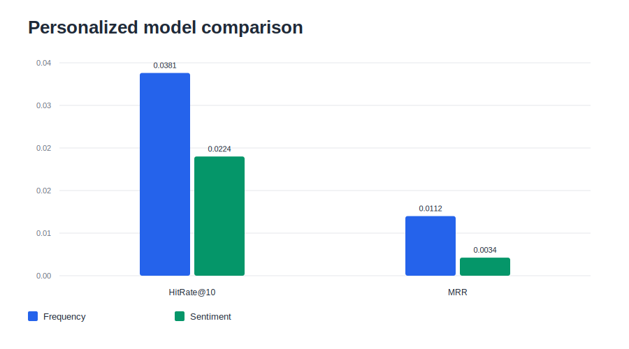

As expected, the personalized metrics are lower than those in the non - personalized context. The drop in performance comes from the difficulty inherent in the problem. Instead of just linking a hotel to another related one, the recommender must create a user profile from few reviews, identify a specific sparse user interest profile and retrieve one specific positive item held out. Despite the size of the dataset, only a small minority of members have enough reviews to support this leave - one - review - out protocol. The 446 positive leave - out instances do not refer to unique users, as each active user may contribute multiple held - out positive instances over time. For both HitRate@10 and MRR metrics, the frequency - based model returns a better result. This implies that if a user's review history is scarce, focusing on shared frequent attributes, such as location, rooms, service or meals, is more reliable than depending on sentiment improvement alone. In this evaluator, novelty and serendipity are calculated on the held - out target instances, so they remain equal across both personalized rankers.

## 7.4 Overall Discussion

The experiments provide a foundation for three key observations.

1. First, Review - derived Hotel Profiles are Useful.

Compared with the baseline Case - Based method, the recommender method focused on frequencies obtains better catalogue coverage and stronger personalized hit rate, although the case - based ranker is strongest on the non - personalized related_hotels proxy in the final frozen - dimension run. This highlights that frequent hotel aspects, based on review mentions, are informative and add value for catalogue exposure and user profile matching, while static metadata and binary feature agreement still remain useful under the available related - hotel proxy.

2. Second, Sentiment Is beneficial But Tied to Objectives and Business Goals.

The Sentiment Enhanced model excels at ranking higher - rated and sentiment - aligned hotels, although it still performs worse than the frequency - based model in terms of catalogue coverage and worse than both alternatives on the related_hotels proxy. This points to a potential interpretation of a sentiment - enhanced recommendation: this is a similar - but - better recommendation type compared with an all - around related - hotel retrieval, under the current proxy measurements.

3. Third, Personalization Is Still The Hardest Ranking setting.

The results provide some evidence to support the hypothesis of user profiling from reviews, but the poor results in HitRate@10 and MRR show how difficult an exact recovery of one of the held - out hotels can be, especially when the information extracted is sparse. It's evident that a personalized hotel recommender should merge review - derived user profiles with information such as social recommendations derived from users' activities and behavioural data.

\newpage

# Chapter 8. Limitations, Ethics and Future Work

## 8.1 Dataset and Evaluation Limitations

Treating related_hotels as ground truth for hotel relevance isn't perfect. While they are available in the data, these hotels might've been recommended due to the website's matching system and not the users' actual interests. Given that related_hotels usually consist of hotels within the same city and the recommender also filters for hotels in the same city during candidate generation, the basis for the proxy relevance measure partly exists within the recommendation process itself.

The effectiveness of the personalized recommendation was limited by the sparsity of the data, meaning only a handful of users were able to satisfy the requirement for performing the leave - one - review out experiment.

The final evaluation build is also partial in its fixed - dimension aspect enrichment. Time constraints required using a clean checkpoint in which 122,259 of 165,843 reviews had frozen - dimension mined_aspects_json. The remaining reviews still contain complete fixed sentiment labels and metadata signals, but the fixed mined dimension coverage is incomplete.

## 8.2 LLM - Related Limitations

Our pipeline of review augmentation requires calling external API endpoints from an LLM, which comes with its own set of problems, such as prompt sensitivity, the unpredictability of the responses, costs to run in production, external influences that can destabilize the performance and a dependence on a third party's infrastructure. We worked to standardize and extract relevant features, however, the quality of these features depends on how the LLM processes our prompts. Different LLMs, prompts and even versions of a specific LLM may yield different outputs.

## 8.3 Representation and Bias

The reviews we collected are representative only of the sentiment of hotel reviewers. As such, their biases, expectations, particular aspects of hotels they prioritize, writing style, culture, language and the bias towards including more reviews for certain categories of hotels will be inherited by the sentiment analysis algorithms. hotels located in other cities or from other demographic segments may not be analyzed or ranked as favorably.

## 8.4 Future Work

A promising research direction would be to merge the review - derived profiles with collaborative filtering profiles. This approach would combine the content of hotel reviews with shared user preferences. The system could also be extended to provide stronger explanations by using real - time saved aspect sentiment profiles. Further research could involve improving diversity in re - ranking, calibrating sentiment weight $\alpha$ by testing different values on various optimization goals and conducting user studies to measure the helpfulness of sentiment - enhanced recommendations for real hotel searchers.

\newpage

# Chapter 9. Conclusion

A review - aware hotel recommendation system based on aspect - sentiment profiles extracted from hotel reviews is proposed and studied in this thesis. First, raw data about hotels, members and reviews is collected. Then, hotel review data dumped from MySQL to parquet format is processed using a language model based sentiment pipeline, whereby reviews are enriched with aspect and sentiment annotations. Consolidated hotel - specific and user - specific sentiment profiles are then used to make recommendations with different algorithms and personalization strategies. The thesis investigates two types of recommendations: non - personalized item - to - item and personalized user - to - item recommendations. The conducted experimentations indicate that a content - aware recommendation system can benefit from mining aspects and sentiments present in hotel reviews, but the strongest model depends on the target objective. In the final frozen - dimension run, the case - based ranker performs best on the non - personalized related_hotels proxy, the frequency - based ranker provides the widest catalogue exposure and better personalized retrieval, and the sentiment - enhanced ranker produces the strongest sentiment alignment, average recommendation rating and novelty.

The sentiment - enhanced recommender achieved better alignment with hotel sentiments, recommended hotels with higher average rating and generated more novelty compared to the frequency - based model, suggesting that sentiment addresses a distinct objective from basic related - hotel retrieval. This research demonstrates the utility of hotel reviews as a component for recommendation systems and shows that LLMs can be used to extract relevant features for a review - aware recommender in an academic context.

\newpage

# References

[1] P. Resnick and H. R. Varian, "Recommender systems," Communications of the ACM, vol. 40, no. 3, pp. 56-58, 1997.

[2] D. Goldberg, D. Nichols, B. M. Oki and D. Terry, "Using collaborative filtering to weave an information tapestry," Communications of the ACM, vol. 35, no. 12, pp. 61-70, 1992.

[3] F. Ricci, L. Rokach and B. Shapira, "Introduction to Recommender Systems Handbook," in Recommender Systems Handbook, Springer, 2011, pp. 1-35.

[4] R. Burke, "Hybrid recommender systems: Survey and experiments," User Modeling and User-Adapted Interaction, vol. 12, no. 4, pp. 331-370, 2002.

[5] G. Adomavicius and A. Tuzhilin, "Toward the next generation of recommender systems: a survey of the state-of-the-art and possible extensions," IEEE Transactions on Knowledge and Data Engineering, vol. 17, no. 6, pp. 734-749, 2005.

[6] M. J. Pazzani and D. Billsus, "Content-based recommendation systems," in The Adaptive Web, Springer, 2007, pp. 325-341.

[7] P. Resnick, N. Iacovou, M. Suchak, P. Bergstrom, and J. Riedl, "GroupLens: an open architecture for collaborative filtering of netnews," in Proceedings of the 1994 ACM Conference on Computer Supported Cooperative Work, 1994, pp. 175-186.

[8] U. Shardanand and P. Maes, "Social information filtering: algorithms for automating 'word of mouth'," in Proceedings of the CHI '95 Conference, 1995, pp. 210-217.

[9] J. A. Konstan, B. N. Miller, D. Maltz, J. L. Herlocker, L. R. Gordon, and J. Riedl, "GroupLens: applying collaborative filtering to Usenet news," Communications of the ACM, vol. 40, no. 3, pp. 77-87, 1997.

[10] J. S. Breese, D. Heckerman, and C. Kadie, "Empirical analysis of predictive algorithms for collaborative filtering," in Proceedings of the 14th Conference on Uncertainty in Artificial Intelligence, 1998, pp. 43-52.

[11] B. Sarwar, G. Karypis, J. Konstan, and J. Riedl, "Item-based collaborative filtering recommendation algorithms," in Proceedings of the 10th International Conference on World Wide Web, 2001, pp. 285-295.

[12] G. Linden, B. Smith, and J. York, "Amazon.com recommendations: item-to-item collaborative filtering," IEEE Internet Computing, vol. 7, no. 1, pp. 76-80, 2003.

[13] A. I. Schein, A. Popescul, L. H. Ungar, and D. M. Pennock, "Methods and metrics for cold-start recommendations," in Proceedings of the 25th Annual International ACM SIGIR Conference, 2002, pp. 253-260.

[14] Y. Koren, R. Bell, and C. Volinsky, "Matrix factorization techniques for recommender systems," Computer, vol. 42, no. 8, pp. 30-37, 2009.

[15] Y. Hu, Y. Koren, and C. Volinsky, "Collaborative filtering for implicit feedback datasets," in Proceedings of the 8th IEEE International Conference on Data Mining, 2008, pp. 263-272.

[16] P. Lops, M. de Gemmis, and G. Semeraro, "Content-based Recommender Systems: State of the Art and Trends," in Recommender Systems Handbook, Springer, 2011, pp. 73-105.

[17] J. Son and S. B. Kim, "Content-based filtering for recommendation systems using multi-attribute data," Expert Systems with Applications, vol. 89, pp. 404-412, 2017.

[18] C. Musto, G. Semeraro, M. de Gemmis, and P. Lops, "Learning Word Embeddings from Wikipedia for Content-Based Recommender Systems," in Advances in Information Retrieval, ECIR 2016, pp. 729-734, 2016, doi: 10.1007/978-3-319-30671-1_60.

[19] L. Chen, G. Chen, and F. Wang, "Recommender systems based on user reviews: the state of the art," User Modeling and User-Adapted Interaction, vol. 25, no. 2, pp. 99-154, 2015.

[20] N. Archak, A. Ghose, and P. G. Ipeirotis, "Deriving the pricing power of product features by mining consumer reviews," Management Science, vol. 57, no. 8, pp. 1485-1509, 2011.

[21] B. Pang and L. Lee, "Opinion mining and sentiment analysis," Foundations and Trends in Information Retrieval, vol. 2, no. 1-2, pp. 1-135, 2008.

[22] Z. Zhang, D. Zhang, and J. Lai, "urCF: User review enhanced collaborative filtering," in Proceedings of the 20th Americas Conference on Information Systems, 2014.

[23] P. Chatterjee, "Online Reviews: Do Consumers Use Them?," in Advances in Consumer Research, vol. 28, 2001, pp. 129-133.

[24] J. Chevalier and D. Mayzlin, "The Effect of Word of Mouth on Sales: Online Book Reviews," Journal of Marketing Research, vol. 43, no. 3, pp. 345-354, 2006.

[25] M. Pontiki et al., "SemEval-2014 Task 4: Aspect Based Sentiment Analysis," in Proceedings of the 8th International Workshop on Semantic Evaluation, 2014, pp. 27-35.

[26] G. Ganu, N. Elhadad, and A. Marian, "Beyond the stars: improving rating predictions using review text content," in Proceedings of the 12th International Workshop on the Web and Databases, 2009.

[27] Y. Zhuang and J. Kim, "A BERT-Based Multi-Criteria Recommender System for Hotel Promotion Management," Sustainability, vol. 13, no. 14, article 8039, 2021, doi: 10.3390/su13148039.

[28] G. Adomavicius and Y. Kwon, "New recommendation techniques for multicriteria rating systems," IEEE Intelligent Systems, vol. 22, no. 3, pp. 48-55, 2007.

[29] R. Dong, M. P. O'Mahony, M. Schaal, K. McCarthy, and B. Smyth, "Combining similarity and sentiment in opinion mining for product recommendation," Journal of Intelligent Information Systems, vol. 46, no. 2, pp. 285-312, 2016, doi: 10.1007/s10844-015-0379-y.

[30] B. Liu, Sentiment Analysis and Opinion Mining. Morgan & Claypool Publishers, 2012.

[31] E. Hasan, M. Rahman, C. Ding, J. X. Huang, and S. Raza, "Review-based Recommender Systems: A Survey of Approaches, Challenges and Future Perspectives," arXiv preprint arXiv:2405.05562, 2024.

[32] J. McAuley and J. Leskovec, "Hidden factors and hidden topics: understanding rating dimensions with review text," in Proceedings of the 7th ACM Conference on Recommender Systems, 2013, pp. 165-172.

[33] N. Tintarev and J. Masthoff, "A survey of explanations in recommender systems," in Proceedings of the 23rd IEEE International Conference on Data Engineering Workshop, 2007, pp. 801-810.

[34] W. X. Zhao et al., "A Survey of Large Language Models," arXiv preprint arXiv:2303.18223, 2023.

[35] X. Wei et al., "ChatIE: Zero-Shot Information Extraction via Chatting with ChatGPT," arXiv preprint arXiv:2302.10205, 2023.

[36] N. Jeong and J. Lee, "An Aspect-Based Review Analysis Using ChatGPT for the Exploration of Hotel Service Failures," Sustainability, vol. 16, no. 4, article 1640, 2024, doi: 10.3390/su16041640.

[37] L. Wu et al., "A Survey on Large Language Models for Recommendation," arXiv preprint arXiv:2305.19860, 2023.

[38] P. Melville, R. J. Mooney, and R. Nagarajan, "Content-boosted collaborative filtering for improved recommendations," in Proceedings of the 18th National Conference on Artificial Intelligence, 2002, pp. 187-192.

[39] S. Zhang, L. Yao, A. Sun, and Y. Tay, "Deep Learning Based Recommender System: A Survey and New Perspectives," ACM Computing Surveys, vol. 52, no. 1, article 5, 2019, doi: 10.1145/3285029.

[40] S. Seo, J. Huang, H. Yang, and Y. Liu, "Interpretable Convolutional Neural Networks with Dual Local and Global Attention for Review Rating Prediction," in Proceedings of the 11th ACM Conference on Recommender Systems, 2017, pp. 297-305, doi: 10.1145/3109859.3109890.

[41] C. Chen, M. Zhang, Y. Liu, and S. Ma, "Neural Attentional Rating Regression with Review-level Explanations," in Proceedings of the 2018 World Wide Web Conference, 2018, pp. 1583-1592, doi: 10.1145/3178876.3186070.

[42] J. L. Herlocker, J. A. Konstan, L. G. Terveen, and J. Riedl, "Evaluating collaborative filtering recommender systems," ACM Transactions on Information Systems, vol. 22, no. 1, pp. 5-53, 2004.

[43] R. Kohavi, R. Longbotham, D. Sommerfield, and R. M. Henne, "Controlled experiments on the web: survey and practical guide," Data Mining and Knowledge Discovery, vol. 18, pp. 140-181, 2009.

[44] S. M. McNee, J. Riedl, and J. A. Konstan, "Being accurate is not enough: how accuracy metrics have hurt recommender systems," in CHI '06 Extended Abstracts on Human Factors in Computing Systems, 2006, pp. 1097-1101.

[45] H. T. Rhee and S.-B. Yang, "Does hotel attribute importance differ by hotel? Focusing on hotel star-classifications and customers' overall ratings," Computers in Human Behavior, vol. 50, pp. 576-587, 2015, doi: 10.1016/j.chb.2015.02.069.

[46] Z. Xiang, Z. Schwartz, J. H. Gerdes Jr., and M. Uysal, "What can big data and text analytics tell us about hotel guest experience and satisfaction?," International Journal of Hospitality Management, vol. 44, pp. 120-130, 2015, doi: 10.1016/j.ijhm.2014.10.013.
